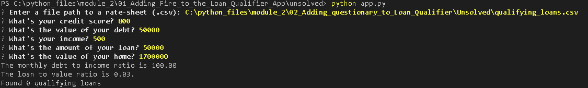

# Loan Qualifier Application

This application will automate the calculations used to determine the qualifications of a loan applicant. The output is determined by both user inputted data, in the CLI, and bank data, located in a CSV document. The hope is to streamline the loan application process and create a smoother procedure for both the customer and business. 

---

## Technologies

This script is written in Python 3.7, and the user will need to have [Python](https://www.python.org/downloads/) downloaded.

The user will also need to install and/or import the following packages:

* [sys](https://docs.python.org/3/library/sys.html) - For interacting with the interpreter.

* [pathlib](https://docs.python.org/3/library/pathlib.html) - For file paths.

* [fire](https://github.com/google/python-fire) - For the command line interface, help page, and entrypoint.

* [questionary](https://github.com/tmbo/questionary) - For interactive user prompts and dialogs

---

## Installation Guide

The user will need to have [Python3](https://www.python.org/downloads/) downloaded. 

The user will then need to install fire and questionary with the following commands:

```python
  pip install fire
  pip install questionary
```

---

## Usage

After locating the GitHub repository, clone it and use your terminal to run the **app.py** with the following command:

```python
python app.py
```

The user then will run the script and follow the prompts to input their information. Here is an example:



---

## Contributors

This project was completed by Austin Caras while enrolled in the UW FinTech continuing education course. You can contact him at caras.austin@gmail.com for any questions.

---

## License

This project is unlicensed and free to use by anyone.

---
